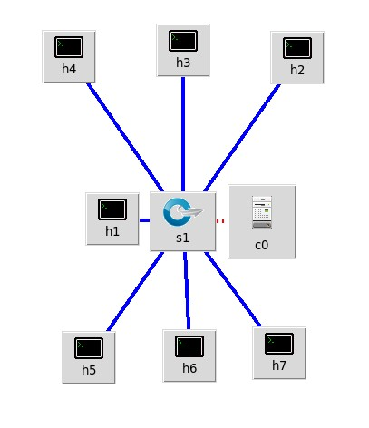
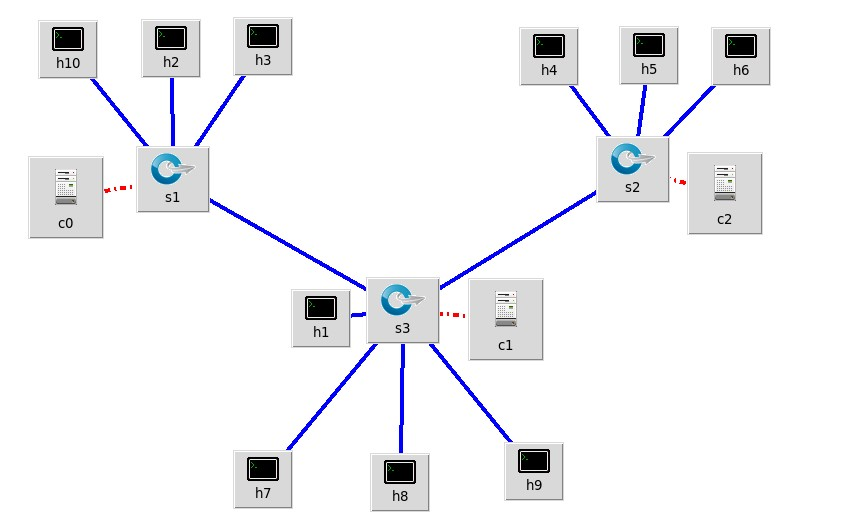

# Network-Load-Balancer-Simulation

Course project for [CSCD58: Computer Networks](https://utsc.calendar.utoronto.ca/course/cscd58h3)

## Stack
* Mininet for network simulations
  * Miniedit tool to generate network topologies
* Python3 (sockets, threading, matplotlib) for building a load balancer, simple client/server and plotting simulation results

## Miniedit Topologies
* Star network topology (**clients**: h4,h3,h2 **backend servers**: h5,h6,h7, **load balancer**: h1)
  
  

* Tree network topology (**clients**: h2,h3,h4,h5,h6,h10 **backend servers**: h7,h8,h9, **load balancer**: h1)

  


## Project Setup

1) Use [this mininet VM](https://cmsweb.utsc.utoronto.ca/marcelo-ponce/CSCD58/Mininet-VM-SR.zip). Import it in your VM software (VMWare, virtual box, etc.)


2) Clone the Repository
    ``` 
    git clone https://github.com/hemant3434/Network-Load-Balancer-Simulation.git  
    ```

3) 
    ```
    cd Network-Load-Balancer-Simulation/
    ```

4) Runs the simulations, on star and tree topologies, running both random and round robin load balancing algorithms 
    ```
    sudo sh setup.sh
    ```

5) To use our plotting script
    ```
    python3 -m pip install matplotlib
    ```
6) Finally to view the average Round trip time (over the number of clients) for 50 requests for both topologies comparing the different load balancing algorithms
    ```
    python3 graph.py
    ```

## Project Structure

* topos directory
  * Houses the miniedit generated topologies and their exported python scripts
  * The exported python scripts for both tree and star topologies are modified to run our simulations by calling either **star_topo_simulation_tests.py** or **tree_topo_simulation_tests.py** which initiate the mininet hosts to run our balancer/client/server programs
* data_capture directory
  * this directory houses the RTT's that are captured by mininet hosts running client.py and is used by our plotting program
* Load balancer algorithm: **socket-load-balancer.py**
  * Uses the text files backend_server_addrs_star/tree_topo.txt to load IP's of the hosts running server.py
  * Sockets and multithreading modules to receive and forward HTTP requests to the various server hosts based on a balancing algorithm
* Simple client: **client.py**
  * Uses requests library to make HTTP request to the balancer
* Simple server: **server.py**
  * Serves local directory content
* Plotting results: **graph.py**
  * Program uses matplotlib to plot the resutls of the simulations